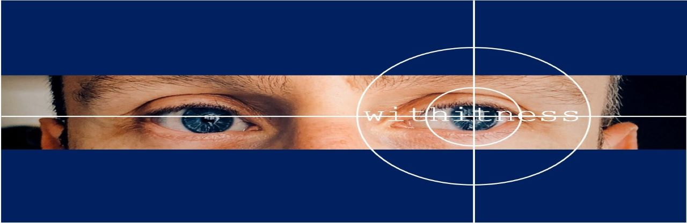
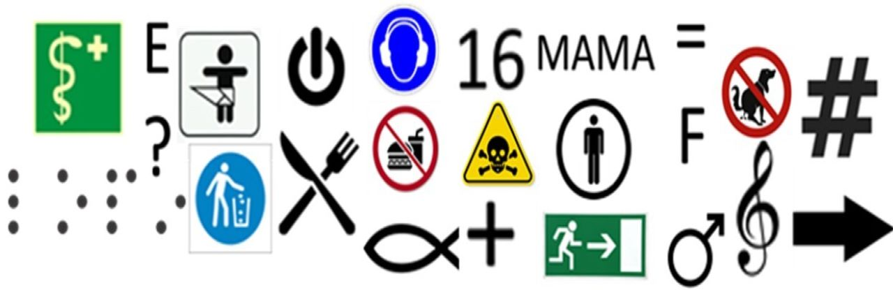

<!-- Section -->
<section>
	<header class="major">
		<h2>Unser Arbeitsbereich</h2>
	</header>
	

	
Zu den Aufgaben unseres Teams zählen die Forschung und wissenschaftliche Vernetzung, die Lehre, die Betreuung von Abschlussarbeiten, die Kooperation mit Schulen sowie die Zusammenarbeit innerhalb der Fakultät beziehungsweise der Universität.

    
<b>In unserer Forschung möchten wir...</b>

	      <ul>
	          <li>Lehr- und Lernprozesse im schulischen Kontext sichtbar machen,</li>
	          <li>Einsichten für die Praxis und die Ausbildung von Lehrenden gewinnen,</li>
	          <li>Methoden und Theorien der empirischen Schul- und Unterrichtsforschung weiterentwickeln.</li>
	      </ul>
	
<b>In der Lehre verantworten wir...</b>

	      <ul>
	          <li> das bildungswissenschafte Modul 2 "Praxis- und Studienfeld Schule",</li>
	          <li>Serminare zu quantitativen und qualitativen Forschungsmethoden.</li>
	      </ul>

</section>

<!-- Section -->
<section>
	<header class="major">
		<h2>Entdecken</h2>
	</header>
	

		<article>
			
			

				<h3><a href="{{ 'news' | absolute_url }}">News</a></h3>
				
Entdecke Ankündigungen und Termine für Veranstaltungen.

			

		</article>
		<article>
			
			

				<h3><a href="{{ 'team' | absolute_url }}">Team</a></h3>
				
Lerne die MitarbeiterInnen der Professur kennen.

			

		</article>
		<article>
			
			

				<h3><a href="{{ 'lehre' | absolute_url }}">Studieren</a></h3>
				
Finde Informationen zu den  Lehrveranstaltungen der Professur.

			

		</article>
		<article>
			
			

				<h3><a href="{{ 'publikationen' | absolute_url }}">Publikationen</a></h3>
				
Erhalte Einblick in die Publikationen der Abteilung.

			

		</article>
		<article>
			
			

				<h3><a href="{{ 'studien' | absolute_url }}">Mitmachen</a></h3>
				
Werde Teil eines unserer Projekte.

			

		</article>
		<article>
			
			

				<h3><a href="{{ 'kontakt_anfahrt' | absolute_url }}">Kontakt und Anfahrt</a></h3>
				
Kontaktiere uns, wenn du mehr erfahren möchtest.

			

		</article>
	

</section>

<!-- Section -->
<section>
	<header class="major">
		<h2>Projekte</h2>
	</header>
	

		<article>
			
			<h3>Von der Relevanz der Präsenz in der Expertiseentwicklung von Lehrpersonen</h3>
			
Das geplante Forschungsprojekt untersucht, inwiefern Präsenz als eine Dimension der Klassenführung objektiv erfasst werden kann und welche Rolle sie für die Expertiseentwicklung von Lehrpersonen spielt.

			<ul class="actions">
				<li><a href="{{ 'projekte#Klatt' | absolute_url }}" class="button">Mehr</a></li>
			</ul>
		</article>
		<article>
			
			<h3>Implizite Überzeugungen bei Lehrkräften</h3>
			
Welche Überzeugungen haben Lehrkräfte von der Veränderbarkeit von Eigenschaften? Welchen Einfluss hat die individuelle Denkweise der Lehrkraft auf die Wahrnehmung seiner Schüler und Schülerinnen? Diesen und ähnlichen Fragen widmet sich das Projekt <i>Implizite Überzeugungen bei Lehrkräften</i>.

			<ul class="actions">
				<li><a href="{{ 'projekte#Frohberg' | absolute_url }}" class="button">Mehr</a></li>
			</ul>
		</article>
		<article>
			
			<h3>Symbolverstehen im Vorschulalter</h3>
			
Welche graphischen Zeichen verstehen Kinder bereits im Vorschulalter und wie leicht fällt es ihnen, unbekannte Zeichen zu interpretieren?  Diesen und ähnlichen Fragen widmet sich unser Projekt <i>Symbolic Literacy</i>.

			<ul class="actions">
				<li><a href="{{ 'projekte#Kachel' | absolute_url }}" class="button">Mehr</a></li>
			</ul>
		</article>
	

</section>
