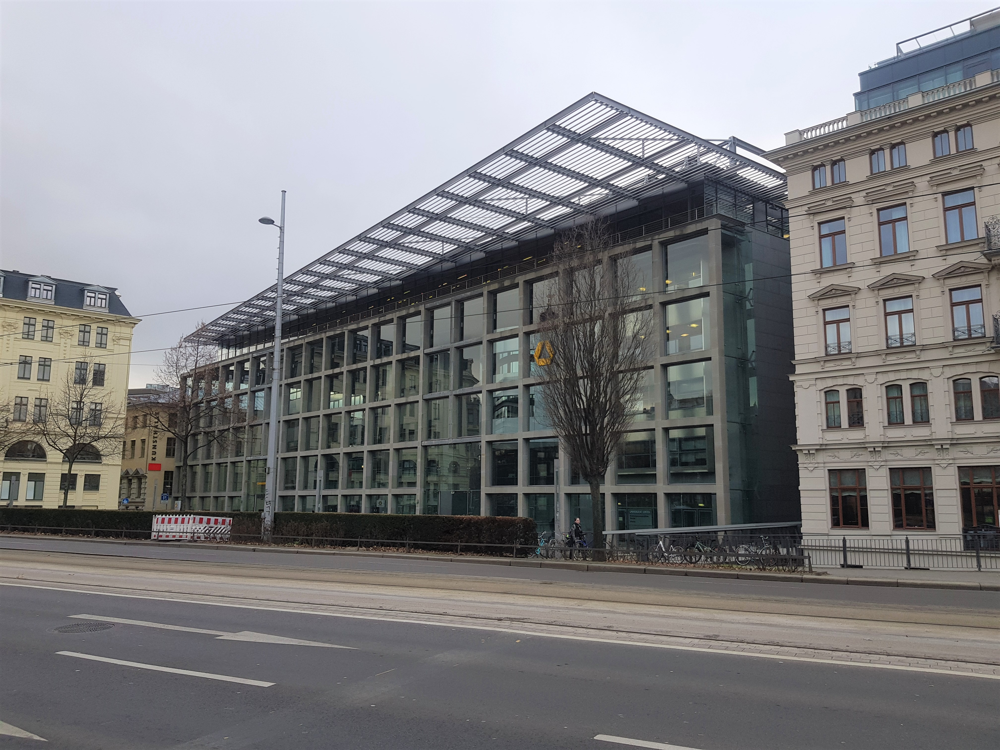

<iframe src="https://www.google.com/maps/embed?pb=!1m18!1m12!1m3!1d2492.5021686958885!2d12.368746415295021!3d51.3386759308473!2m3!1f0!2f0!3f0!3m2!1i1024!2i768!4f13.1!3m3!1m2!1s0x47a6f826e1d7ff6d%3A0xc2ce10d57bdf591!2sDittrichring%205%2C%2004109%20Leipzig!5e0!3m2!1sde!2sde!4v1592205257329!5m2!1sde!2sde" width="900" height="400" frameborder="0" style="border:0;" allowfullscreen="" aria-hidden="false" tabindex="0"></iframe>

***

    

        <h3>Anschrift</h3>
        
Universität Leipzig Erziehungswissenschaftliche Fakultät 
        Institut für Bildungswissenschaften 
        Professur für Empirische Schul- und Unterrichtsforschung 
        Dittrichring 5-7 
        04109 Leipzig

    

    

        <h3>Inhaberin der Professur</h3>
        
Prof. Dr. Anne Deiglmayr 
        Raum 008 
        Dittrichring 5-7 
        04109 Leipzig

        
Tel.: +49 (0) 341 97-31571  
        E-Mail: <a href="anne.deiglmayr@uni-leipzig.de">anne.deiglmayr@uni-leipzig.de</a> 
        Sprechzeit: Mittwoch 11:00-12:00 Uhr

    

    

        <h3>Sekretariat</h3>
        
Anne-Kathrin Pagel 
        Raum 009 
        Dittrichring 5-7 
        04109 Leipzig

        
Tel.: +49 (0) 341 97-31570   
        E-Mail: <a href="empschul@uni-leipzig.de">empschul@uni-leipzig.de</a>  Sprechzeit: Mittwoch 09:00-12:00 Uhr

    

***

<h3>Anreise</h3>  

Die Büros und das Labor der Professur für "Empirische Schul- Unterrichtsforschung" befinden sich am Dittrichring und schräg gegenüber der Thomaskirche im westlichen Zentrum Leipzigs. Das Gebäude erreichen Sie über eine der beiden größeren Brücken über dem Pleißemühlgraben. Auf der linken Seite des Gebäudes befindet sich die Commerzbank, auf der rechten Seite die Erziehungswissenschaftliche Fakultät der Universität Leipzig. Nutzen Sie den Haupteingang und gehen sie anschließend nach rechts. Öffnen Sie die Glastür zum Computerbereich und die folgende Holztür zu den Büros und Seminarräumen der Fakultät. Die Räumlichkeiten unseres Teams befinden sich entlang des Ganges im Erdgeschoss.
 

    

		

		

		

  
    

		

Sie erreichen uns schnell und einfach mit dem Auto, dem ÖPNV, dem Fahrrad oder auch zu Fuß.

<h4>Auto:</h4>

Parkmöglichkeiten finden Sie in dem Parkhaus am Thomaskirchhof, dem Tief-Parkhaus in der Zentralstraße 7 oder dem Marthin-Luther-Ring Parkhaus in der Otto-Schill-Straße 3. Die Räumlichkeiten der Professur erreichen sie von dort aus binnen weniger Minuten zu Fuß.
 

<h4>Öffentliche Verkehrsmittel:</h4>

Von der Haltestelle "Hauptbahnhof/ Tief" wählen Sie eine der <b>S-Bahnen</b> S1/ S2 Stötteritz, S3 Wurzen, S4 Markleeberg-Gaschwitz, S5/ S5X Zwickau Hbf oder S6 Borna bis zur Haltstelle "Markt". Die Räumlichkeiten der Professur erreichen sie von dort aus binnen weniger Minuten zu Fuß.

Von der Haltestelle "Hauptbahnhof/ Westseite" können Sie die <b>Tram</b> 9 S-Bf. Connewitz bis zu zur Haltestelle "Thomaskirche" benutzen. Direkt gegenüber befindet sich das Gebäude mit den Räumlichkeiten der Professur.  
<b>(ACHTUNG: derzeit aufgrund von aktuellen Baumaßnahmen am Goerdelerring nicht möglich!)</b>

Von der Haltestelle "Hauptbahnhof/ Goethestraße" können Sie aktuell die <b>Buslinie</b> 89 Connewitzer Kreuz bis zur Haltestelle "Thomaskirche" nutzen.
  

<h4>Fahrrad/ zu Fuß:</h4>

Vom Hauptbahnhof aus erreichen Sie die Räumlichkeiten der Professur mit dem Fahrrad in ca. 6 Minuten und zu Fuß innerhalb von ca. 15 Minuten.
 

&nbsp;

<h3>Wir freuen uns, Sie kennenzulernen!</h3> 
