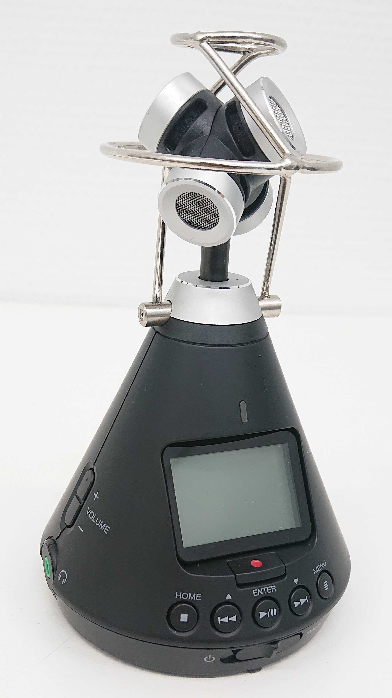

Ein fester und wichtiger Bestandteil unserer Forschungsarbeit ist unser mobiles Labor "m3uvi-Lab". Zu diesem erhalten Sie im Nachfolgenden interessante und nützliche Informationen.

  
<h2>Name "m3uvi-Lab"</h2>

Der Name m3uvi-Lab steht für mobile, multi-modale Unterrichtsvideografie. 

<h2>Forschungszweck</h2>

In unserer Forschung geht es uns darum, Lehr- und Lernprozesse im schulischen Kontext sichtbar zu machen. Wir möchten unter anderem wissen, wie Lehrkräfte und Lernende im Unterricht miteinander interagieren, worauf Lehrpersonen ihre Aufmerksamkeit richten und wodurch sich erfahrene Lehrkräfte von Unerfahrenen unterscheiden. Um diesen und weiteren Fragen nachzugehen haben wir ein mobiles Labor entwickelt, mit welchem wir in realen Unterrichtssituationen verschiedene Audio- und Videodaten erheben, die später automatisch analysiert werden können.

<h2>Aufbau und Einsatz</h2>

Zu unserem mobilen Labor gehört eine <b>mobile Eye-Tracking-Brille</b>, um das Blickverhalten der Lehrperson während des Unterrichts zu erfassen. Der Eye-Tracker von Tobii Pro Glasses 2 besteht aus einer tragbaren Kopfeinheit und einer Aufzeichnungseinheit. Eine in der Kopfeinheit integrierte Szenenkamera zeichnet das Gesehene in Full HD auf und ein integriertes Mikrofon nimmt die Umgebungsgeräusche auf.

Um verbale Äußerungen, die paraverbale Kommunikation und andere Klassenzimmergeräusche analysieren zu können, wird ein <b>Audiorecorder</b> (Zoom H3-VR Handy Recorder) mittig im Klassenraum platziert. Durch mehrere Mikrofone werden 360-Grad-Audioaufnahmen gemacht. Des Weiteren wird die Lehrperson mit einem tragbaren Mikrofon ausgestattet, um das Gesagte aufzuzeichnen.

Bewegungen, Mimik und Gesten der Schüler und Schülerinnen sowie der Lehrperson werden von <b>vier Kameras</b> (GoPro Hero7) aus verschiedenen Winkeln aufgenommen. Eine Kamera wird so installiert, dass sie seitlich das Klassengeschehen filmt. Zwei weitere Kameras werden zum einen an der Tafel, zum anderen am Ende des Labors angebracht, um die Lehrperson und Klasse von vorne bzw. hinten aufzunehmen. Darüber hinaus ist es angedacht, die vierte Kamera so anzubringen, dass nur Mimik und Gestik der Lehrperson erfasst werden. Alle Kameras zeichnen das Unterrichtsgeschehen in Full HD auf. Der Audiorecorder und die vier Kameras werden über Timecode synchronisiert, sodass die gleichgeschaltete Aufnahme von Audio- wie Videodaten möglich ist.

Die während des Unterrichts verwendeten Materialien werden von uns abfotografiert. Ferner wird der Unterricht von einem vorher trainierten Mitarbeitenden live codiert, um unterrichtsrelevante Ereignisse zu erfassen. Im Anschluss an jede aufgezeichnete Unterrichtseinheit ist es angedacht, Schüler und Schülerinnen wie auch Lehrpersonen mittels Fragebögen zu verschiedenen Dimensionen der Unterrichtsqualität zu befragen.

<h2>Methoden</h2>

Die folgende Abbildung gibt einen Überblick über die von uns verwendeten Methoden und ihrer Anordnung im Klassenraum:

