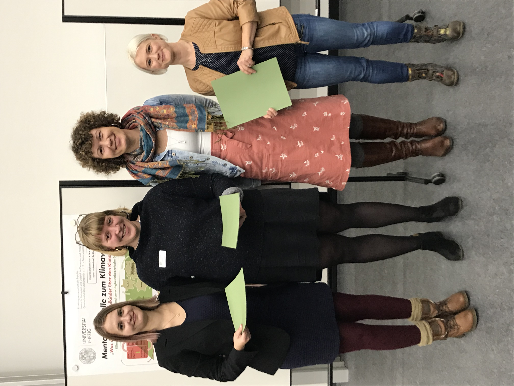

## Ankündigungen, Termine und Veranstaltungen

**Einladung zur Studienteilnahme**

Der Startschuss für unsere erste Studie ist gefallen!    
Das Projekt zielt darauf ab zu untersuchen, worauf Lehrkräfte während des Unterrichtens achten und wie sie auf Schüler und Schülerinnen wirken. Im Rahmen der Arbeitsgruppe möchten wir nun eine erste Untersuchung starten und dazu brauchen wir Ihre Hilfe:

Sie sind als Lehrer oder Leherin tätig oder möchten es gerne werden?  
Sie haben bereits Lehrerfahrung sammeln können? Umso besser!  

Wir suchen Lehrpersonen, die im Schuldienst arbeiten und Lust darauf haben, in der Forschung mitzuwirken, um die Brücke zwischen Praxis und Theorie zu stärken. 

Haben Sie Interesse und möchten mehr erfahren? 
Weitere Informationen zur Studie und den Kontaktangaben finden Sie im offiziellen Einladungsschreiben <a href="/assets/pdfs/Einladung_Pilotstudie.pdf">[&rarr; PDF]</a> oder unter [Studenteilnahme](https://empschul-leipzig.github.io/studien).

***

**[Aktuelles Forschungsprojekt](https://empschul-leipzig.github.io/projekte)**

Am Lehrstuhl für "Empirische Schul- und Unterrichtsforschung" untersuchen wir aktuell, wie junge und erfahrene Lehrer sich im Unterrichtskontext bewegen, Gestik einsetzen und ihre Aufmerksamkeit verteilen. Gegenwärtig versuchen wir klassische Verhaltensanalysen mit automatisierter Audio- und Videoanalyse zu kombinieren und Gesten- und Objekterkennungssoftware für die Bildungsforschung nutzbar zu machen.
 
***

**Dies Academicus, 02.12.2019**

Alljährlich feiert die Universität Leipzig den akademischen Feiertag "Dies academicus". Die Erziehungswissenschaftliche Fakultät verleiht in jedem Jahr an diesem Tag den Posterpreis "Dies Award". Den diesjährigen Preis erhielt unsere Mitarbeiterin Franziska Frohberg für ihr Poster zum Thema "Implizite Theorien von Intelligenz bei Lehramtsstudierenden" <a href="/assets/pdfs/Frohberg_Poster_2019_12_02.pdf">[&rarr; PDF]</a>.

