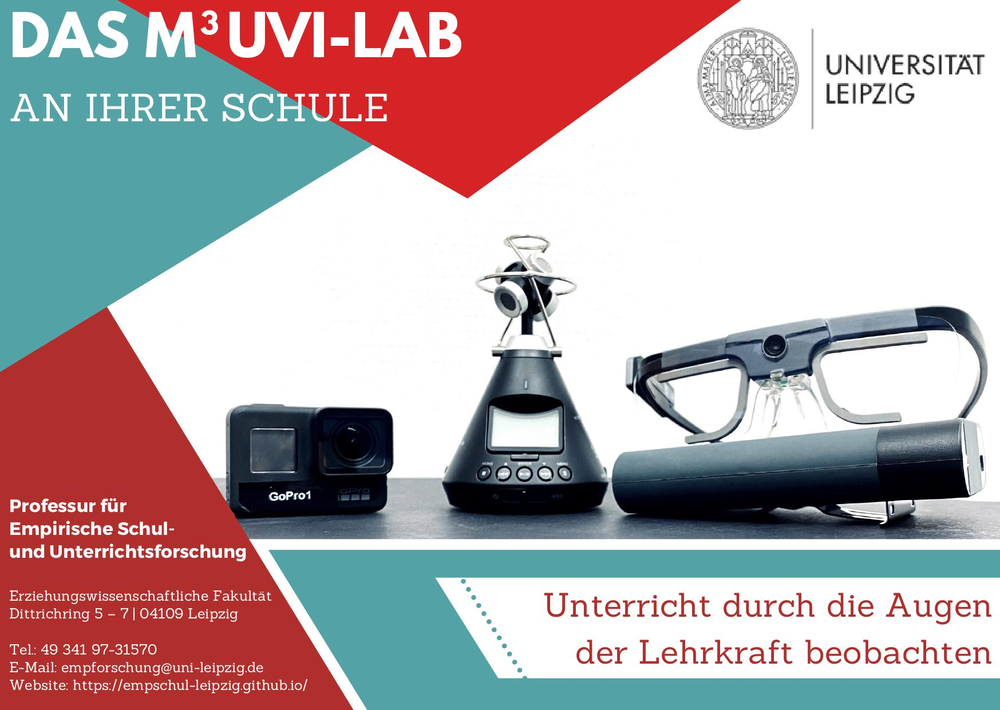

## Ankündigungen, Termine und Veranstaltungen

<h3>ProVisioNET im "m3uvi-Lab"</h3>

Unsere wissenschaftliche Mitarbeiterin <a href="https://empschul-leipzig.github.io/team#Klatt">Mandy Klatt</a> führt nun im Rahmen ihrer Dissertation ihre erste Studie namens ProVisioNET durch, in der sie erforscht, worauf (angehende) Lehrpersonen ihre visuelle Aufmerksamkeit während des Unterrichtens lenken.

Derzeit ist sie auf der Suche nach Studienteilnehmenden, wobei Lehramtsstudierende ab dem 3. Fachsemester oder Lehrpersonen (inklusive Referendariat) in Frage kommen. Im Gegenzug für Ihre Unterstützung erhalten Sie die einmalige Möglichkeit, Ihren eigenen Unterricht durch Ihre Augen mittels innovativer Technik wie Eye-Tracking zu beobachten. Weitere Informationen finden Sie im Fyler <a href="/assets/pdfs/Klatt_Studienteilnahme_ProVisioNET.pdf">[&rarr; Download]</a>. Falls Sie weitere Lehrpersonen kennen, die die Teilnahmevoraussetzungen erfüllen und interessiert sein könnten, dann informieren Sie diese gern.
 

Bei Fragen kontaktieren Sie sie am besten per <a href="mailto:mandy.klatt@uni-leipzig.de">E-Mail</a> oder Telefon <a href="tel:+4903419731572">(+49 (0) 341 97-31572)</a>.

<h3>Das "m3uvi-Lab" an Schulen</h3>

Bald schon können wir mit unserem "m3uvi-Lab" endlich an die Leipziger Schulen kommen!

Sie kennen interessierte Lehrkräfte oder Schulleitungen, die von unserem Projekt noch nicht erfahren haben? Dann leiten Sie doch gern unseren Teaser mit allen wichtigen Kontaktangaben weiter! Den Teaser zu unserem „m3uvi-Lab“ finden Sie hier zum <a href="/assets/pdfs/Karte_m3uvi-lab_final.pdf">[&rarr; Download]</a>.

Wir freuen uns, von Ihnen zu hören!

<h3>Erste Ergebnisse der Pilotstudie</h3>

Der nächste Schritt ist erfolgreich getan: Es liegen nun erste Ergebnisse zu der Pilotstudie mit dem mobilen Labor vor!

Sie finden diese auf dem zugehörigen Poster "Expert and novice teachers managing classroom disruptions: First findings from a pilot study in the lab". Um dieses aufzurufen, klicken Sie <a href="/assets/pdfs/Mandy_Klatt_Poster_SIG27.pdf">[&rarr; HIER]</a>.

<h3>Einladung zur Studienteilnahme</h3>

Der Startschuss für unsere erste Studie ist gefallen!

Im Rahmen der Arbeitsgruppe möchten wir nun eine erste Untersuchung starten und dazu brauchen wir Ihre Hilfe: Wir suchen Lehrpersonen, die im Schuldienst arbeiten und Interesse daran haben, in der Forschung mitzuwirken, um die Brücke zwischen Praxis und Theorie zu stärken. 
Unser Projekt zielt darauf ab zu untersuchen, worauf Lehrkräfte während des Unterrichtens achten und wie sie auf Schüler und Schülerinnen wirken. Ziel dabei ist es, verschiedene mehrkanalige Daten wie Eye-Tracking-, Audio- und Videodaten während des Unterrichtens zu sammeln.

Haben Sie Interesse und möchten mehr erfahren? 
Weitere Informationen zur Studie und den Kontaktangaben finden Sie im offiziellen Einladungsschreiben <a href="/assets/pdfs/Einladung_Pilotstudie.pdf">[&rarr; PDF]</a> oder unter [Studienteilnahme](https://empschul-leipzig.github.io/studien).

<h3>Aktuelles Forschungsprojekt</h3>

Am Lehrstuhl für "Empirische Schul- und Unterrichtsforschung" untersuchen wir aktuell, wie junge und erfahrene Lehrkräfte sich im Unterrichtskontext bewegen, Gestik einsetzen und ihre Aufmerksamkeit verteilen. Gegenwärtig versuchen wir klassische Verhaltensanalysen mit automatisierter Audio- und Videoanalyse zu kombinieren sowie Gesten- und Objekterkennungssoftware für die Bildungsforschung nutzbar zu machen.

 

<h3>Dies Academicus, 02.12.2019</h3>

Alljährlich feiert die Universität Leipzig den akademischen Feiertag "Dies academicus". Die Erziehungswissenschaftliche Fakultät verleiht in jedem Jahr an diesem Tag den Posterpreis "Dies Award". Den diesjährigen Preis erhielt unsere Mitarbeiterin Franziska Frohberg für ihr Poster zum Thema "Implizite Theorien von Intelligenz bei Lehramtsstudierenden" <a href="/assets/pdfs/Frohberg_Poster_2019_12_02.pdf">[&rarr; PDF]</a>.
