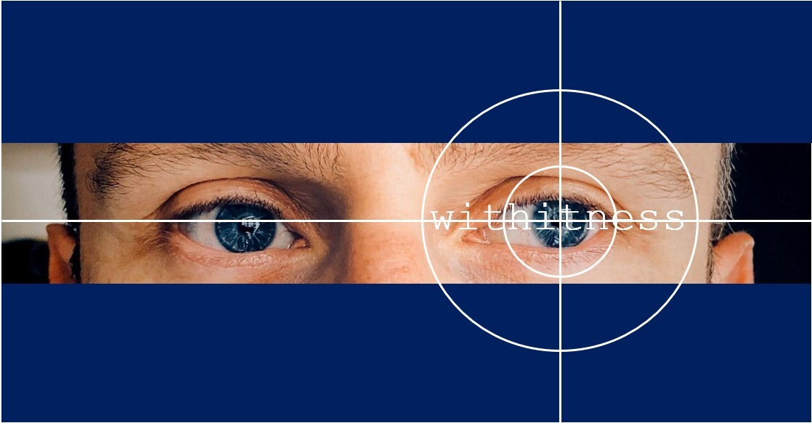
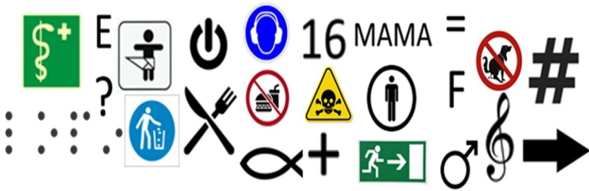

An der Professur für "Empirische Schul- und Unterrichtsforschung" untersuchen wir aktuell, wie junge und erfahrene Lehrer sich im Unterrichtskontext bewegen, Gestik einsetzen und ihre Aufmerksamkeit verteilen. Gegenwärtig versuchen wir klassische Verhaltensanalysen mit automatisierter Audio- und Videoanalyse zu kombinieren und Gesten- und Objekterkennungssoftware für die Bildungsforschung nutzbar zu machen.

***

<article id="Klatt">
<h2>Von der Relevanz der Präsenz in der Expertiseentwicklung von Lehrpersonen</h2>

<b>Verantwortliche/AnsprechpartnerIn:</b> <a href="https://empschul-leipzig.github.io/team#Klatt">Mandy Klatt</a>

Ein wesentliches Strukturmerkmal guten Unterrichts stellt in der Unterrichtsforschung das Klassenmanagement dar, wobei die Allgegenwärtigkeit bzw. Präsenz von Lehrpersonen einen entscheidenden Aspekt bildet. Lehrpersonen mit einem hohen Grad an Präsenz vermitteln SchülerInnen den Eindruck, alles im Blick zu haben und auf verschiedene Situationen gleichzeitig reagieren zu können. Doch was genau ist unter der Allgegenwärtigkeit der Lehrperson zu verstehen? Wie kann diese Dimension objektiv erfasst werden? Und welche Rolle spielt sie für die Expertiseentwicklung von (angehenden) LehrerInnen? 
Um diese und weitere Fragen zu beantworten, werden in verschiedenen Studien Daten mittels multimodaler Prozessmessungen (mobile Eye-Tracking-Technologie, Audio- und Videoaufnahmen, Fragebogen) erhoben. Die in dem Projekt durchzuführenden Untersuchungen sind von kontinuierlicher Relevanz für die Ausbildung von Lehrpersonen, da die Befunde der Studien dazu dienen sollen, Konsequenzen und Implikationen für die Praxis abzuleiten und so in der universitären Vorbereitungszeit aktiv einen Beitrag zur Ausbildung von Lehrpersonen zu leisten.  
Für die Studien sind wir stets auf der Suche nach Lehrkräften, ReferendarInnen und Lehramtsstudierenden, die mit uns im Labor oder in ihren Schulen zusammenarbeiten wollen. Bei Interesse melden Sie sich bitte per <a href="mailto:mandy.klatt@uni-leipzig.de">E-Mail</a>.

</article>

***

<article id="Frohberg">
<h2>Implizite Überzeugungen bei Lehrkräften</h2>

<b>Verantwortliche/AnsprechpartnerIn:</b> <a href="https://empschul-leipzig.github.io/team#Frohberg">Franziska Frohberg</a>

Bei der Bewältigung von Situationen des alltäglichen Lebens orientieren sich Menschen häufig an Alltagstheorien. Lehrkräfte haben subjektive Überzeugungen darüber, welches Erziehungsverhalten bei bestimmten SchülerInnen effektiv ist. Diese Gewissheit über die Gültigkeit von Alltagtheorien ergibt sich zum einen aus der selektiven Wahrnehmung, und zum anderen als Effekt der Sich-selbst-erfüllenden-Prophezeiung, da man sich gegenüber einer anderen Person so verhält, dass deren Reaktion die eigene Annahme bestätigt. Im Projekt wird untersucht, welche Effekte implizite Überzeugungen von Lehrkräften auf Ihre SchülerInnen haben. In dieser Studie werden Videoaufnahmen von Unterricht gemacht sowie Fragebögen für Lehrkräften und SchülerInnen verwendet. (<b>Poster:</b> <a href="/assets/pdfs/Frohberg_Poster_2019_12_02.pdf">[&rarr; PDF]</a>)  
Für unsere Studie suchen wir jederzeit Lehrkräfte, ReferendarInnen und Lehramtsstudierende für Videoaufnahmen in ihren Schulen. Bei Interesse melden Sie sich bitte per <a href="mailto:franziska.frohberg@uni-leipzig.de">E-Mail</a>.

</article>

***

<article id="Kachel">
<h2>Symbolverstehen im Vorschulalter</h2>

<b>Verantwortliche/AnsprechpartnerIn:</b> <a href="https://empschul-leipzig.github.io/team#Kachel">Dr. Gregor Kachel</a>

Buchstaben, Zahlen, Schilder und Ikone,…graphische Symbole umgeben uns fast überall. Sie begleiten uns im Alltag so selbstverständlich, dass wir sie kaum noch sehen oder bewusst interpretieren müssen. Wie aber sprechen diese Zeichen zu Kindern, die noch nicht lesen und schreiben können oder es gerade erst lernen? In unserem Projekt Symbolic Literacy untersuchen wir, welche konventionellen graphischen Symbole Kinder schon früh verstehen und ob sie auch in der Lage sind neue und unbekannte Zeichen spontan zu deuten. Für diese Studien nutzen wir Tabletcomputer auf denen Kindern kurze Bilderbuchgeschichten präsentiert werden. Um in der Studie bei einer Frage eine Auswahl zu treffen, können die Kinder dann den Bildschirm an der entsprechenden Stelle berühren. Für unsere Studien suchen wir immer interessierte Eltern mit Kindern im Alter zwischen 2 und 8 Jahren, aber auch regelmäßig Erwachsene, die Lust haben selbst teilzunehmen. Testungen können im Kindergarten, bei uns im Institut aber auch bald schon online stattfinden. Bei Interesse melden Sie sich bitte per <a href="mailto:gregor.kachel@uni-leipzig.de">E-Mail</a>. 
Symbolic Literacy ist ein <a href="https://www.dfg.de">DFG</a>-gefördertes Forschungsprojekt, das wir gemeinsam mit der Abteilung für vergleichende Kulturpsychologie am <a href="https://www.eva.mpg.de/comparative-cultural-psychology/index.html">MPI für Evolutionäre Anthropologie</a> durchführen.

</article>

