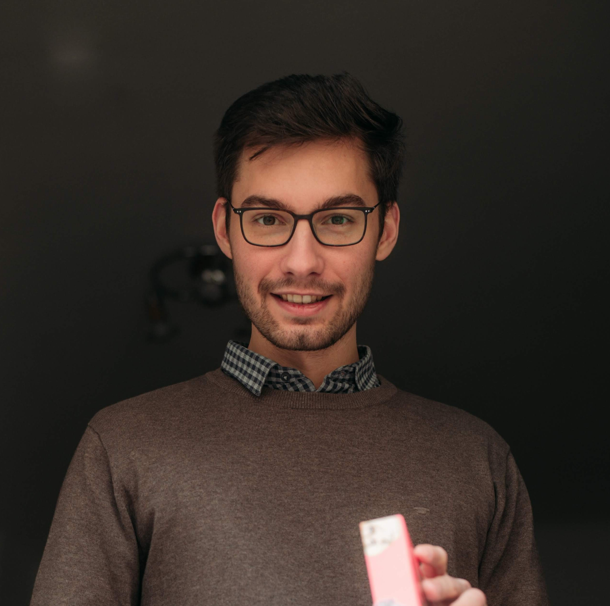

<!--Team-->
<h2>Wer wir sind</h2>

In unserem Arbeitsbereich "Empirische Schul- und Unterrichtsforschung" an der Erziehungswissenschaftlichen Fakultät der Universität Leipzig lehren und forschen wissenschaftliche Mitarbeitende und abgeordnete Lehrpersonen unter der Leitung von Prof. Dr. Anne Deiglmayr. Wir werden dabei unterstützt durch unsere Sekretärin und unsere wissenschaftlichen und studentischen Hilfskräfte.

<h2>Inhaberin der Professur</h2>

<!--Deiglmayr-->
<article id="Deiglmayr">
<h3>Prof. Dr. Anne Deiglmayr</h3>

<b>Professorin</b>

</article>

Prof. Dr. Anne Deiglmayr ist seit 12/2018 Inhaberin der Professur "Empirische Schul- und Unterrichtsforschung" an der Erziehungswissenschaftlichen Fakultät der Universität Leipzig. 
Ihre Forschungsschwerpunkte umfassen u.a. Methoden der mobilen Unterrichtsforschung, die Professionsentwicklung von Lehrpersonen, Lehr- und Lernprozesse beim (computergestützten) kooperativen Lernen, sowie die Förderung des Lehrens und Lernens im MINT-Unterricht. 
Prof. Deiglmayr bietet Lehrveranstaltungen im Bereich der bildungswissenschaftlichen Module der Lehramtsstudiengänge (insbesondere Modul 02 "Praxis- und Studienfeld Schule") sowie im Bereich der Ergänzungsstudien an (insbesondere zu Methoden der empirischen Sozialforschung). 

<table class="tab24" align="center" border="0" cellpadding="0" cellspacing="0" width="100%">
<tr bgcolor="#BDBDBD">
<td width="33%" height="30" style="padding-left:15px; padding-right:15px;">
<b>Kontakt und Weiteres</b>
</td>
<td align="right" width="33%" style="padding-left:15px; padding-right:15px;">
<a href="#swap" onclick="javascript:swap('Einblenden','Ausblenden', 'swaplink', 'hideme')" id="swaplink" onfocus="this.blur()" name="swaplink">Einblenden</a>
</td>
</tr> 
<tr style=" text-align: justify; font-size: 14px; font-weight: normal; background-color: rgb(242,242,242);">
<td colspan="3" style="padding-left:15px; padding-right:15px;">

  

 
  

    <strong>Telefon:</strong> +49 (0) 341 97-31571  
    <strong>E-Mail:</strong> <a href="mailto:anne.deiglmayr@uni-leipzig.de">anne.deiglmayr@uni-leipzig.de</a>  
    <strong>Raum:</strong> 008  
    <strong>Sprechzeit:</strong> Mittwoch 11:00-12:00 Uhr

  
<b>Kurzbiografie</b>

      

        <table>
          <tbody>
            <tr>
              <td>seit 2018</td>
              <td>Professorin für Empirische Schul- und Unterrichtsforschung an der Erziehungswissenschaftlichen Fakultät der Universität Leipzig</td>
            </tr>
            <tr>
              <td>2013-2018</td>
              <td>Oberassistentin am Lehrstuhl für Lehr- und Lernforschung, ETH Zürich</td>
            </tr>
            <tr>
              <td>2012-2013</td>
              <td>Postdoc am Lehrstuhl für Lehr- und Lernforschung, ETH Zürich: Marie-Heim-Vögtlin-Stipendium des Schweizer Nationalfonds</td>
            </tr>
            <tr>
              <td>2011-2012</td>
              <td>Dozentin mit Forschungsauftrag am Institut für Medien und Schule der Pädagogischen Hochschule Zentralschweiz</td>
            </tr>
            <tr>
              <td>2008-2010</td>
              <td>Wissenschaftliche Mitarbeiterin in der Abteilung Allgemeine Psychologie der Albert-Ludwigs-Universität Freiburg</td>
            </tr>
            <tr>
              <td>2009</td>
              <td>Promotion (Dr. phil.), Albert-Ludwigs-Universität Freiburg; ausgezeichnet mit dem Eugen-Fink-Nachwuchsförderpreis (2011)</td>
            </tr>
            <tr>
              <td>2005-2008</td>
              <td>Stipendiatin im Virtuellen Graduiertenkolleg „Wissenserwerb und Wissensaustausch mit neuen Medien” (DFG)</td>
            </tr>
            <tr>
              <td>2005</td>
              <td>Diplom (Dipl.-Psych.), Albert-Ludwigs-Universität Freiburg</td>
            </tr>
            <tr>
              <td>2002-2003</td>
              <td>Studium am Department of Psychology der University of Michigan, Ann Arbor</td>
            </tr>
            <tr>
              <td>1999-2005</td>
              <td>Studium der Psychologie, Albert-Ludwigs-Universität Freiburg</td>
            </tr>
          </tbody>
        </table>
      

  
<b>Publikationen und Vorträge</b>

  Klicken Sie hier: <a href="/assets/pdfs/Publikationen_Deiglmayr.pdf">[&rarr; PDF]</a>

</td>
</tr>
</table> 

<h2>Sekretariat</h2>

  
<!--Habelt-->

<h3>Henriette Habelt</h3>

<b>Sekretärin</b>

Henriette Habelt ist Sekretärin an der Professur "Empirische Schul- und Unterrichtsforschung" an der Erziehungswissenschaftlichen Fakultät der Universität Leipzig. 

<table class="tab24" align="center" border="0" cellpadding="0" cellspacing="0" width="100%">
<tr bgcolor="#BDBDBD">
<td width="33%" height="30" style="padding-left:15px; padding-right:15px;">
<b>Kontakt und Weiteres</b>
</td>
<td align="right" width="33%" style="padding-left:15px; padding-right:15px;">
<a href="#swap" onclick="javascript:swap('Einblenden','Ausblenden', 'swaplink1', 'hideme1')" id="swaplink1" onfocus="this.blur()" name="swaplink1">Einblenden</a>
</td>
</tr> 
<tr style=" text-align: justify; font-size: 14px; font-weight: normal; background-color: rgb(242,242,242);">
<td colspan="3" style="padding-left:15px; padding-right:15px;">

  

 

  
<b>Telefon:</b> +49 (0) 341 97-31570 
  <b>E-Mail:</b> <a href="mailto:empschul@uni-leipzig.de">empschul@uni-leipzig.de</a> 
  <b>Raum:</b> 009

</td>
</tr>
</table>

<h2>Wissenschatliche Mitarbeitende</h2>

<!--Kachel-->
<article id="Kachel">
<h3>Dr. Gregor Kachel</h3>

<b>Postdoktorand</b>

</article>

Gregor Kachel leitet das DFG-Projekt SymLit und forscht darin zur Entwicklung des graphischen Symbolverständnisses im Vorschulalter. Er ist wissenschaftlicher Mitarbeiter an der Professur für "Empirische Schul- und Unterrichtsforschung" und Gastwissenschaftler in der Abteilung für Vergleichende Kulturpsychologie am MPI EVA. 

<table class="tab24" align="center" border="0" cellpadding="0" cellspacing="0" width="100%">
<tr bgcolor="#BDBDBD">
<td width="33%" height="30" style="padding-left:15px; padding-right:15px;">
<b>Kontakt und Weiteres</b>
</td>
<td align="right" width="33%" style="padding-left:15px; padding-right:15px;">
<a href="#swap" onclick="javascript:swap('Einblenden','Ausblenden', 'swaplink2', 'hideme2')" id="swaplink2" onfocus="this.blur()" name="swaplink2">Einblenden</a>
</td>
</tr> 
<tr style=" text-align: justify; font-size: 14px; font-weight: normal; background-color: rgb(242,242,242);">
<td colspan="3" style="padding-left:15px; padding-right:15px;">

  

 
  
<b>Telefon:</b> +49 (0) 341 97-31573 
  <b>E-Mail:</b> <a href="mailto:gregor.kachel@uni-leipzig.de">gregor.kachel@uni-leipzig.de</a> 
  <b>Raum:</b> 005 
  <b>Webseite:</b> <a href="https://gregorkachel.github.io">https://gregorkachel.github.io</a>

  
<b>Publikationen</b>

  Klicken Sie hier: <a href="/assets/pdfs/Publikationen_Kachel.pdf">[&rarr; PDF]</a>

</td>
</tr>
</table>

<!--Lotz-->
<article id="Lotz">
<h3>Dr. Christin Lotz</h3>

<b>Postdoktorandin</b>

</article>

Dr. Christin Lotz forscht als wissenschaftliche Mitarbeiterin an der Professur "Empirische Schul- und Unterrichtsforschung" an der Erziehungswissenschaftlichen Fakultät der Universität Leipzig. Ihre Interessenschwerpunkte umfassen Intelligenz und komplexes Problemlösen bei der Vorhersage von Schulerfolg. Darüber hinaus forscht sie zu motivationalen Konstrukten wie akademisches Selbstkonzept und Interesse sowie Leistungsängstlichkeit. 

<table class="tab24" align="center" border="0" cellpadding="0" cellspacing="0" width="100%">
<tr bgcolor="#BDBDBD">
<td width="33%" height="30" style="padding-left:15px; padding-right:15px;">
<b>Kontakt und Weiteres</b>
</td>
<td align="right" width="33%" style="padding-left:15px; padding-right:15px;">
<a href="#swap" onclick="javascript:swap('Einblenden','Ausblenden', 'swaplink3', 'hideme3')" id="swaplink3" onfocus="this.blur()" name="swaplink3">Einblenden</a>
</td>
</tr> 
<tr style=" text-align: justify; font-size: 14px; font-weight: normal; background-color: rgb(242,242,242);">
<td colspan="3" style="padding-left:15px; padding-right:15px;">

  

  
<b>Telefon:</b> +49 (0) 341 97-31578 
  <b>E-Mail:</b> <a href="mailto:christin.lotz@uni-leipzig.de">christin.lotz@uni-leipzig.de</a> 
  <b>Raum:</b> 005

  <b>Sprechzeit:</b> Dienstag 14:00-15:00 Uhr

  
<b>Kurzbiografie</b>

  

        <table>
          <tbody>
            <tr>
              <td>seit 09/2020</td>
              <td>Postdoc am Lehrstuhl für "Empirische Schul- und Unterrichtsforschung" an der Erziehungswissenschaftlichen Fakultät der Universität Leipzig</td>
            </tr>
            <tr>
              <td>08/2018-04/2020</td>
              <td>Berufliche Auszeit (Weltreise)</td>
            </tr>
            <tr>
              <td>06/2012-06/2018</td>
              <td>Doktorandin am Lehrstuhl für "Diagnostik, Beratung, Intervention" an der Universität des Saarlandes</td>
            </tr>
            <tr>
              <td>10/2006-06/2012</td>
              <td>Studium der Psychologie, Universität Trier</td>
            </tr>
          </tbody>
        </table>
      

 
<b>Publikationen</b>

  Klicken Sie hier: <a href="/assets/pdfs/Publikationsliste_Christin Lotz.pdf">[&rarr; PDF]</a>

</td>
</tr>
</table>  

<!--Klatt-->
<article id="Klatt">
<h3>Mandy Klatt</h3>

<b>Doktorandin</b>

</article>

Mandy Klatt forscht und lehrt als wissenschaftliche Mitarbeiterin im Arbeitsbereich "Empirische Schul- und Unterrichtsforschung" an der Erziehungswissenschaftlichen Fakultät der Universität Leipzig. 
Im Mittelpunkt ihrer Forschungsinteressen stehen neue, multimodale Methoden zur Erforschung von Lehr- und Lernprozessen wie Eye-Tracking, Audio- und Videografie im Unterricht. 

<table class="tab24" align="center" border="0" cellpadding="0" cellspacing="0" width="100%">
<tr bgcolor="#BDBDBD">
<td width="33%" height="30" style="padding-left:15px; padding-right:15px;">
<b>Kontakt und Weiteres</b>
</td>
<td align="right" width="33%" style="padding-left:15px; padding-right:15px;">
<a href="#swap" onclick="javascript:swap('Einblenden','Ausblenden', 'swaplink4', 'hideme4')" id="swaplink4" onfocus="this.blur()" name="swaplink4">Einblenden</a>
</td>
</tr> 
<tr style=" text-align: justify; font-size: 14px; font-weight: normal; background-color: rgb(242,242,242);">
<td colspan="3" style="padding-left:15px; padding-right:15px;">

  

 

  
<b>Telefon:</b> +49 (0) 341 97-31572 
  <b>E-Mail:</b> <a href="mailto:mandy.klatt@uni-leipz.de">mandy.klatt@uni-leipzig.de</a> 
  <b>Raum:</b> 010 
  <b>Sprechzeit:</b> Mittwoch 11:00-12:00 Uhr

  
  
<b>Kurzbiografie</b>

  

        <table>
          <tbody>
            <tr>
              <td>seit 10/2019</td>
              <td>Wissenschaftliche Mitarbeiterin an der Universität Leipzig, Erziehungswissenschaftliche Fakultät, Professur für Empirische Schul- und Unterrichtsforschung</td>
            </tr>
            <tr>
              <td>05/2019-09/2019</td>
              <td>Übersetzungs- und Dolmetschertätigkeit in Frankreich</td>
            </tr>
            <tr>
              <td>04/2018-04/2019</td>
              <td>Lehrtätigkeit für Deutsch als Fremdsprache in Frankreich, Sekundarstufe I + II</td>
            </tr>
            <tr>
              <td>05/2017-10/2017</td>
              <td>Lehrtätigkeit für Deutsch als Zweitsprache, Flüchtlingsrat Leipzig e.V.</td>
            </tr>
            <tr>
              <td>10/2011-03/2018</td>
              <td>Studium Deutsch und Französisch für Höheres Lehramt an Gymnasien an der Universität Leipzig/ 1. Staatsexamen</td>
            </tr>
          </tbody>
        </table>
      

 
<b>Wissenschaftliche Poster</b>

  Klicken Sie hier: <a href="/assets/pdfs/Mandy_Klatt_Poster_SIG27.pdf">[&rarr; PDF]</a>

</td>
</tr>
</table>

<!--Frohberg-->
<article id="Frohberg">
<h3>Franziska Frohberg</h3>

<b>Doktorandin</b>

</article>

Franziska Frohberg lehrt und forscht am Institut für Bildungswissenschaften an der Professur für "Empirische Schul- und Unterrichtsforschung" an der Universität Leipzig. 
Sie lehrt in den Modulen 1 und 2 der Bildungswissenschaften. 
Im Mittelpunkt ihrer Forschungsinteressen stehen Implizite Theorie zu Intelligenz, Veränderung von Mindsets bei Lehrpersonen und deren Einfluss auf Lehr-Lern-Arrangements. 
 

<table class="tab24" align="center" border="0" cellpadding="0" cellspacing="0" width="100%">
<tr bgcolor="#BDBDBD">
<td width="33%" height="30" style="padding-left:15px; padding-right:15px;">
<b>Kontakt und Weiteres</b>
</td>
<td align="right" width="33%" style="padding-left:15px; padding-right:15px;">
<a href="#swap" onclick="javascript:swap('Einblenden','Ausblenden', 'swaplink5', 'hideme5')" id="swaplink5" onfocus="this.blur()" name="swaplink5">Einblenden</a>
</td>
</tr> 
<tr style=" text-align: justify; font-size: 14px; font-weight: normal; background-color: rgb(242,242,242);">
<td colspan="3" style="padding-left:15px; padding-right:15px;">

  

  
  
<b>Telefon:</b> +49 (0) 341 97-31572 
  <b>E-Mail:</b> <a href="mailto:franziska.frohberg@uni-leipzig.de">franziska.frohberg@uni-leipzig.de</a> 
  <b>Raum:</b> 010 
  <b>Sprechzeit:</b> Dienstag 09:00-10:00 Uhr (Anmeldung per E-Mail)

  
  
<b>Kurzbiografie</b>

 

        <table>
          <tbody>
            <tr>
              <td>seit 08/2019</td>
              <td>Lehrkraft für besondere Aufgaben im Arbeitsbereich Allgemeine Didaktik</td>
            </tr>
            <tr>
              <td>seit 02/2019</td>
              <td>Lehrkraft für besondere Aufgaben im Arbeitsbereich Empirische Schul- und Unterrichtsforschung</td>
            </tr>
            <tr>
              <td>2015-2018</td>
              <td>Master Begabungsforschung und Kompetenzentwicklung, Universität Leipzig</td>
            </tr>
            <tr>
              <td>2014-2015</td>
              <td>Integrationspädagogin an der Montessorischule Huckepack Dresden e.V. </td>
            </tr>
            <tr>
              <td>2011-2015 </td>
              <td>Bachelor Pädagogik mit Nebenfach Psychologie, Technische Universität Chemnitz</td>
            </tr>
          </tbody>
        </table>
      

</td>
</tr>
</table>

<!--De Groote-->
<article id="deGroote">
<h3>Carola de Groote</h3>

<b>Doktorandin</b>

Carola de Groote lehrt als abgeordnete Lehrerin in den Modulen 1 und 2 am Institut für Bildungswissenschaften an der Professur für "Empirische Schul- und Unterrichtsforschung" an der Universität Leipzig und bringt hier ihre 25-jährige gymnasiale Lehrtätigkeit ein. 
Im Mittelpunkt ihrer Forschungsinteressen stehen Begabungsförderung an Regelschulen, begabungsförderlicher Unterricht sowie Schulentwicklung. 

<table class="tab24" align="center" border="0" cellpadding="0" cellspacing="0" width="100%">
<tr bgcolor="#BDBDBD">
<td width="33%" height="30" style="padding-left:15px; padding-right:15px;">
<b>Kontakt und Weiteres</b>
</td>
<td align="right" width="33%" style="padding-left:15px; padding-right:15px;">
<a href="#swap" onclick="javascript:swap('Einblenden','Ausblenden', 'swaplink6', 'hideme6')" id="swaplink6" onfocus="this.blur()" name="swaplink6">Einblenden</a>
</td>
</tr> 
<tr style=" text-align: justify; font-size: 14px; font-weight: normal; background-color: rgb(242,242,242);">
<td colspan="3" style="padding-left:15px; padding-right:15px;">

  

   
  
<b>Telefon:</b> +49 (0) 341 97-31572 
  <b>E-Mail:</b> <a href="mailto:carola.de_groote@uni-leipzig.de">carola.de_groote@uni-leipzig.de</a> 
  <b>Raum:</b> 010 
  <b>Sprechzeit:</b> Freitag 15:00-16:00 Uhr

  
  
<b>Kurzbiografie</b>

 

        <table>
          <tbody>
            <tr>
              <td>seit 08/2019</td>
              <td>Abgeordnete Lehrkraft am Arbeitsbereich Empirische Schul- und Unterrichtsforschung</td>
            </tr>
            <tr>
              <td>seit 08/2006</td>
              <td>Immanuel-Kant-Gymnasium Leipzig, Lehrerin für die Fächer Deutsch und Englisch</td>
            </tr>
            <tr>
              <td>08/1995-07/2006</td>
              <td>Gymnasium Engelsdorf, Lehrerin für die Fächer Deutsch und Englisch</td>
            </tr>
            <tr>
              <td>08/1993-07/1995</td>
              <td>Werner-Heisenberg-Gymnasium Leipzig, Vorbereitungsdienst für das Höhere Lehramt an Gymnasien; Fachkombination Deutsch und Englisch; 2. Staatsexamen</td>
            </tr>
            <tr>
              <td>10/1987-07/1993</td>
              <td>Karl-Marx-Universität Leipzig (KMU)/ Universität Leipzig – Alma Mater Lipsiensis, Lehramtsstudium der Fächer Deutsch und Englisch für das Höhere Lehramt an Gymnasien; Erstes Staatsexamen</td>
            </tr>
          </tbody>
        </table>
      

</td>
</tr>
</table>

<!--Leistner-->

<h3>Mirjam Leistner</h3>

<b>Lehrkraft für besondere Aufgaben</b>

Mirjam Leistner lehrt als Lehrkraft für besondere Aufgaben im Studiengang Lehramt an der Universität Leipzig im Fachbereich Bildungswissenschaften. 

<table class="tab24" align="center" border="0" cellpadding="0" cellspacing="0" width="100%">
<tr bgcolor="#BDBDBD">
<td width="33%" height="30" style="padding-left:15px; padding-right:15px;">
<b>Kontakt und Weiteres</b>
</td>
<td align="right" width="33%" style="padding-left:15px; padding-right:15px;">
<a href="#swap" onclick="javascript:swap('Einblenden','Ausblenden', 'swaplink7', 'hideme7')" id="swaplink7" onfocus="this.blur()" name="swaplink7">Einblenden</a>
</td>
</tr> 
<tr style=" text-align: justify; font-size: 14px; font-weight: normal; background-color: rgb(242,242,242);">
<td colspan="3" style="padding-left:15px; padding-right:15px;">

  

 
  
  
<b>Telefon:</b> +49 (0) 341 97-31432 
  <b>E-Mail:</b> <a href="mirjam.leistner@uni-leipzig.de">mirjam.leistner@uni-leipzig.de</a> 
  <b>Raum:</b> 107 

</td>
</tr>
</table>

<h2>Studentische und Wissenschaftliche Hilfskräfte</h2>

  
<!--Steinbock-->

<h3>Celine Steinbock</h3>

Celine Steinbock studiert den Studiengang Lehramt an Oberschulen mit den Fächern Biologie und Geschichte an der Universität Leipzig. An der Professur für "Empirische Schul- und Unterrichtsforschung" ist sie als studentische Hilfskraft tätig. 

<table class="tab24" align="center" border="0" cellpadding="0" cellspacing="0" width="100%">
<tr bgcolor="#BDBDBD">
<td width="33%" height="30" style="padding-left:15px; padding-right:15px;">
<b>Kontakt und Weiteres</b>
</td>
<td align="right" width="33%" style="padding-left:15px; padding-right:15px;">
<a href="#swap" onclick="javascript:swap('Einblenden','Ausblenden', 'swaplink8', 'hideme8')" id="swaplink8" onfocus="this.blur()" name="swaplink8">Einblenden</a>
</td>
</tr> 
<tr style=" text-align: justify; font-size: 14px; font-weight: normal; background-color: rgb(242,242,242);">
<td colspan="3" style="padding-left:15px; padding-right:15px;">

  

  
<b>E-Mail:</b> <a href="mailto:empschul_hiwi@uni-leipzig.de">empschul_hiwi@uni-leipzig.de</a> 
  <b>Raum:</b> 009 

</td>
</tr>
</table>
  
<!--Zachrau-->

<h3>Jonathan Zachrau</h3>

Jonathan Zachrau studiert Höheres Lehramt an Gymnasien mit den Fächern Mathematik und Deutsch an der Universität Leipzig. An der Professur "Empirische Schul- und Unterrichtsforschung" ist er als studentische Hilfskraft tätig. 

<table class="tab24" align="center" border="0" cellpadding="0" cellspacing="0" width="100%">
<tr bgcolor="#BDBDBD">
<td width="33%" height="30" style="padding-left:15px; padding-right:15px;">
<b>Kontakt und Weiteres</b>
</td>
<td align="right" width="33%" style="padding-left:15px; padding-right:15px;">
<a href="#swap" onclick="javascript:swap('Einblenden','Ausblenden', 'swaplink9', 'hideme9')" id="swaplink9" onfocus="this.blur()" name="swaplink9">Einblenden</a>
</td>
</tr> 
<tr style=" text-align: justify; font-size: 14px; font-weight: normal; background-color: rgb(242,242,242);">
<td colspan="3" style="padding-left:15px; padding-right:15px;">

  

  
<b>E-Mail:</b> <a href="mailto:jonathan.zachrau@uni-leipzig.de">jonathan.zachrau@uni-leipzig.de</a> 
  <b>Raum:</b> 009 

</td>
</tr>
</table>
  
<!--Schuster-->

<h3>Gina Maria Schuster</h3>

 

<table class="tab24" align="center" border="0" cellpadding="0" cellspacing="0" width="100%">
<tr bgcolor="#BDBDBD">
<td width="33%" height="30" style="padding-left:15px; padding-right:15px;">
<b>Kontakt und Weiteres</b>
</td>
<td align="right" width="33%" style="padding-left:15px; padding-right:15px;">
<a href="#swap" onclick="javascript:swap('Einblenden','Ausblenden', 'swaplink10', 'hideme10')" id="swaplink10" onfocus="this.blur()" name="swaplink10">Einblenden</a>
</td>
</tr> 
<tr style=" text-align: justify; font-size: 14px; font-weight: normal; background-color: rgb(242,242,242);">
<td colspan="3" style="padding-left:15px; padding-right:15px;">

  

  
<b>E-Mail:</b> <a href="mailto:empschul_hiwi@uni-leipzig.de">empschul_hiwi@uni-leipzig.de</a> 
  <b>Raum:</b> 009 

</td>
</tr>
</table>

<!--Heidemeyer-->

<h3>Anne Heidemeyer</h3>

 

<table class="tab24" align="center" border="0" cellpadding="0" cellspacing="0" width="100%">
<tr bgcolor="#BDBDBD">
<td width="33%" height="30" style="padding-left:15px; padding-right:15px;">
<b>Kontakt und Weiteres</b>
</td>
<td align="right" width="33%" style="padding-left:15px; padding-right:15px;">
<a href="#swap" onclick="javascript:swap('Einblenden','Ausblenden', 'swaplink11', 'hideme11')" id="swaplink11" onfocus="this.blur()" name="swaplink11">Einblenden</a>
</td>
</tr> 
<tr style=" text-align: justify; font-size: 14px; font-weight: normal; background-color: rgb(242,242,242);">
<td colspan="3" style="padding-left:15px; padding-right:15px;">

  

  
<b>E-Mail:</b> <a href="mailto:empschul_hiwi@uni-leipzig.de">empschul_hiwi@uni-leipzig.de</a> 
  <b>Raum:</b> 009 

</td>
</tr>
</table>

<!--Lugovaya-->

<h3>Anna Lugovaya</h3>

Anna Lugovaya studiert Lehramt an Grundschulen mit dem Kernfach Ethik und dem Lehramtserweiterungsfach Deutsch als Zweitsprache. An der Professur "Empirische Schul- und Unterrichtsforschung" ist sie als studentische Hilfskraft tätig.  

<table class="tab24" align="center" border="0" cellpadding="0" cellspacing="0" width="100%">
<tr bgcolor="#BDBDBD">
<td width="33%" height="30" style="padding-left:15px; padding-right:15px;">
<b>Kontakt und Weiteres</b>
</td>
<td align="right" width="33%" style="padding-left:15px; padding-right:15px;">
<a href="#swap" onclick="javascript:swap('Einblenden','Ausblenden', 'swaplink12', 'hideme12')" id="swaplink12" onfocus="this.blur()" name="swaplink12">Einblenden</a>
</td>
</tr> 
<tr style=" text-align: justify; font-size: 14px; font-weight: normal; background-color: rgb(242,242,242);">
<td colspan="3" style="padding-left:15px; padding-right:15px;">

  

  
<b>E-Mail:</b> <a href="mailto:empschul_hiwi@uni-leipzig.de">empschul_hiwi@uni-leipzig.de</a> 
  <b>Raum:</b> 009 

</td>
</tr>
</table>

<!--Schmidtke-->

<h3>Anna Schmidtke</h3>

Anna Schmidtke studiert den Studiengang Höheres Lehramt an Gymnasien mit den Fächern Deutsch und Ethik an der Universität Leipzig. An der Professur für "Empirische Schul- und Unterrichtsforschung" ist sie als studentische Hilfskraft tätig. 

<table class="tab24" align="center" border="0" cellpadding="0" cellspacing="0" width="100%">
<tr bgcolor="#BDBDBD">
<td width="33%" height="30" style="padding-left:15px; padding-right:15px;">
<b>Kontakt und Weiteres</b>
</td>
<td align="right" width="33%" style="padding-left:15px; padding-right:15px;">
<a href="#swap" onclick="javascript:swap('Einblenden','Ausblenden', 'swaplink13', 'hideme13')" id="swaplink13" onfocus="this.blur()" name="swaplink13">Einblenden</a>
</td>
</tr> 
<tr style=" text-align: justify; font-size: 14px; font-weight: normal; background-color: rgb(242,242,242);">
<td colspan="3" style="padding-left:15px; padding-right:15px;">

  

 
  
<b>E-Mail:</b> <a href="mailto:empschul_hiwi@uni-leipzig.de">empschul_hiwi@uni-leipzig.de</a> 
  <b>Raum:</b> 009 

</td>
</tr>
</table>

<h2>Ehemalige Mitarbeitende</h2>

  
<!--Pagel-->

<h3>Anne-Kathrin Pagel</h3>

<b>ehemalige Sekretärin</b>

Anne-Katrhin Pagel war Sekretärin an der Professur "Empirische Schul- und Unterrichtsforschung" an der Erziehungswissenschaftlichen Fakultät der Universität Leipzig. 

<!--Hawlitschek-->
  
<h3>Patrick Hawlitschek</h3>

<b>ehemalige studentische Hilfskraft</b>

Patrick Hawlitschek absolvierte die Studiengänge Lehramt an Gymnasien (Deutsch/Ethik) und Soziologie an der Universität Leipzig. An der Professur für "Empirische Schul- und Unterrichtsforschung" war er als Studentische Hilfskraft tätig. Seine Interessen liegen in den Methoden der empirischen Sozialforschung und der angewandten Statistik. 

<!--Eulitz-->

<h3>Gereon Eulitz</h3>

<b>ehemaliger wissenschaftlicher Mitarbeiter</b>

Gereon Eulitz war Lehrer im Hochschuldienst und gehörte der Professur "Empirische Schul- und Unterrichtsforschung" an. Sein Forschungsinteresse gilt der kooperativen Unterrichtsentwicklung. Das Modul 05-BWI-02 (SPS) "Praxis- und Studienfeld Schule" waren Schwerpunkt seiner Lehrtätigkeit. Außerdem wirkt er an der Mentorenqualifizierung im Freistaat Sachsen mit. 
  
<!--Pelikan-->

<h3>Anna Pelikan</h3>

<b>ehemalige studentische Hilfskraft</b>

Anna Pelikan studiert Höheres Lehramt an Gymnasien für die Fächer Englisch und Deutsch an der Universität Leipzig. An der Professur für "Empirische Schul- und Unterrichtsforschung" war sie als studentische Hilfskraft tätig.  
  
<!--Keßler-->

<h3>Peer Keßler</h3>

<b>ehemalige studentische Hilfskraft</b>

Peer Keßler studiert im Master Soziologie an der Universität Leipzig. An der Professur für "Empirische Schul- und Unterrichtsforschung" war er als studentische Hilfskraft tätig.  
  
<!--Becker-->

<h3>Franziska Becker</h3>

<b>ehemalige studentische Hilfskraft</b>

 
  
<!--Becker-->

<h3>Fine Saeltzer</h3>

<b>ehemalige studentische Hilfskraft</b>

 

